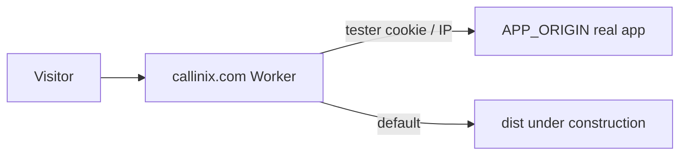

# Deploy Callinx under-construction to callinix.com

## Wrong GitHub repo?

Cloudflare project **`callinix-const-worker`** must use repo **`awunjia/callinix-const-worker`**.

The app code lives in **`awunjia/callinix-const`** unless you push it to the worker repo (this project is pushed to both).

If the worker repo only has a README, deploys will fail with *Could not detect static files*.

---

## Why the GitHub clone failed (exit code 128)

Cloudflare expects a **`main`** branch by default. This repo only had **`prod`**, so the clone failed with:

`Failed: source repo failed to clone`

### Fix (pick one)

**A. In Cloudflare dashboard (fastest)**  
Workers & Pages → your project → **Settings** → **Build** → set **Production branch** to `prod`.

**B. Add a `main` branch on GitHub** (matches Cloudflare default):

```bash
git push origin prod:main
```

Then reconnect the project or trigger a new deploy.

**Also check:** GitHub → Settings → Applications → **Cloudflare Workers & Pages** is installed and has access to `awunjia/callinix-const` (required if the repo is private).

---

## Build settings (Cloudflare Workers — Git deploy)

Your deploy command must **install dependencies and build** before Wrangler uploads assets.

| Setting | Value |
|--------|--------|
| **Deploy command** | `npm ci && npx wrangler deploy` |
| Root directory | `/` |
| Node version | `20` |

Do **not** use `npx wrangler deploy` alone — `dist/` will not exist and you will get:

`Could not detect a directory containing static files`

`wrangler.toml` includes `[build] command = "npm run build"`, so `wrangler deploy` runs Vite after `npm ci`.

Alternative deploy command: `npm run cf:deploy`

---

## Routing: public vs testing team

Use the **Worker** in `worker/index.js` on `callinix.com`:

| Visitor | Sees |
|--------|------|
| Everyone | Under-construction React site (`dist/`) |
| Testers | Real app at `APP_ORIGIN` |

### Tester access (any one)

1. **Preview link** (set secret first):
   ```bash
   npx wrangler secret put PREVIEW_SECRET
   ```
   Share: `https://callinix.com/?preview=YOUR_SECRET`  
   Sets a 30-day cookie and redirects to the site without the query string.

2. **IP allowlist** — in `wrangler.toml` or dashboard:
   ```
   TESTER_IPS = "203.0.113.10,198.51.100.2"
   ```

3. **Cloudflare Access** — add a check in `worker/index.js` for `Cf-Access-Jwt-Assertion` if you use Zero Trust.

### Configure real app URL

Edit `wrangler.toml`:

```toml
APP_ORIGIN = "https://app.callinix.com"   # or your Workers/Pages app URL
```

### Deploy from your machine

```bash
npm install
npm run deploy
```

### Custom domain

Cloudflare dashboard → Worker `callinix-const` → **Settings** → **Domains & Routes** → add `callinix.com` and `www.callinix.com`.

Remove conflicting routes on other workers so only this worker handles `callinix.com/*`.

---

## Architecture


